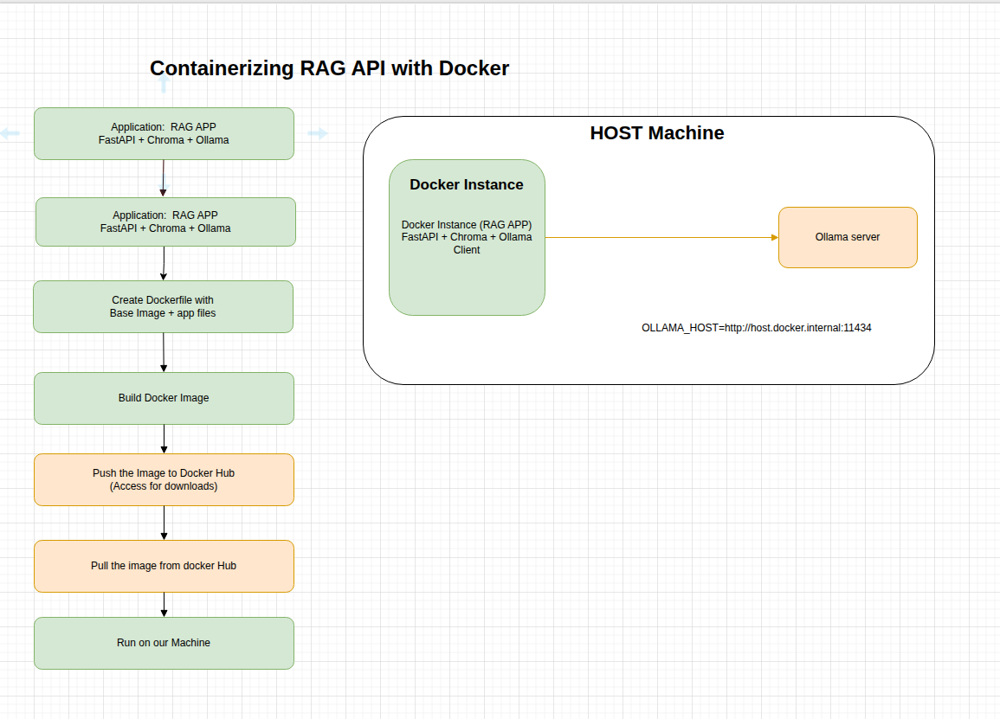

## RAG API with FastAPI
    Part1: Develop RAG API with FastAPI Application
    Part2: Containerize RAG API with Docker 
    Part3: Deploy into K8
    Part4: Github Actions workflows

    Reference - https://learn.nextwork.org/projects/ai-devops-api


---

### Part1: RAG with FastAPI

#### RAG workflow:


```bash
 1 Receive question 
 2 Search knowledge base with Chroma 
 3 Get relevant context 
 4 Combine context + question 
 5 Send to Ollamas tinyllama
 6 Return AI-generated answer based on your documents

```

---   
#### Environment Setup
1. Run Ollama LLM Locally 
2. Setup python environment


```bash

# Install and run a model locally
ollama --version
ollama run tinyllama    # run ollama with the given model
curl localhost:11434    # message: Ollama is running

# python setup
python -version         # make sure verion >= 3.12
python -m venv .venv    # create virtual env
source .venv/bin/activate
# deactivate (once work is done)

# install the required packages
pip install fastapi uvicorn chromadb ollama
pip list | grep -E "fastapi|uvicorn|chromadb|ollama"

```

#### Build KB and create FastAPI instance using 
1. Run Ollama LLM Locally 
2. Setup python environment

```bash

# create embed.py   # Build KB in chroma DB by storing the information
# create app.py     # FastAPI webserver, app.py file with "app" FastAPI instance  

# run uvicorn server
uvicorn --version
uvicorn app:app --host 127.0.0.1 --port 8000    # Start a FastAPI application with specified port
uvicorn app:app --reload                        # Auto detect changes
```


---

#### Test the Application

```bash

# From CLI
curl -X POST "http://127.0.0.1:8000/query" -G --data-urlencode "q=What is Kubernetes?"

# From Swagger UI
Open your browser: http://127.0.0.1:8000/docs
Test the /query endpoint with "What is Kubernetes?"
```
---

### Part2: Containerize RAG API with Docker 

#### Infra setup
Ollama is running on host machine and application is running on docker containier 
How to make docker instance access the ollama server running on the host machine ?
- Update ollama.client() method by adding the host info: 
- Update ollama service Configuration with Environment details (to allow access from outside)
- Verify firewall port 11434 is opened (using firewall-cmd and ss command for this)




---

#### Access to Ollama service from docker instance
```bash
# Update ollama service so that it can access from docker instance (or anywhere)
sudo vi /etc/systemd/system/ollama.service 
  # Update Service details with Environment="OLLAMA_HOST=0.0.0.0:11434"
sudo systemctl daemon-reload
sudo systemctl restart ollama

# Verify port info.. it should show 0.0.0.0:11434 or *:11434 instead of 127.0.0.1:11434
ss -lt src :11434

```

#### Allow firewall port
```bash
# Allow port 11434:
sudo firewall-cmd --add-port=11434/tcp --permanent
sudo firewall-cmd --reload

# Verify:
sudo firewall-cmd --list-ports
```

---


#### Build the docker Image
```bash
# Create and update dockerfile with required files
cd ~/python-proj/RAGWithFastAPI/2-RAGAPIDocker

touch dockerfile

# docker works on local context only, copy files into directory where dockerfile exits
cp ../1-RAGwithFastAPI/app.py ../1-RAGwithFastAPI/embed.py ../1-RAGwithFastAPI/k8s.txt ./  

# build docker Image
docker build -t rag-app .

# Verify the image
docker images | grep rag-app
```

#### Run the docker Instance using docker cmd or docker compose
```bash
# Method 1 - using docker command line
# Start the rag-app container at port 8000
docker run \
  --add-host=host.docker.internal:host-gateway \
  -e OLLAMA_HOST=http://host.docker.internal:11434 \
  -p 8000:8000 \
  rag-app


# Method 2 - using docker compose
# Create docker-compose.yml file with Image details (name, port, host environment details)
touch docker-compose.yml 
docker compose up
docker compose up -d
# docker compose down

# login to running instance and verify ollama access/run and fastapi running status
docker exec -it {docker-instance} /bin/bash
curl  $OLLAMA_HOST
curl localhost:8000/health

```
---

#### Test the Application from host machine
```bash
curl -X POST "http://127.0.0.1:8000/query" -G --data-urlencode "q=What is Kubernetes?"

```

---